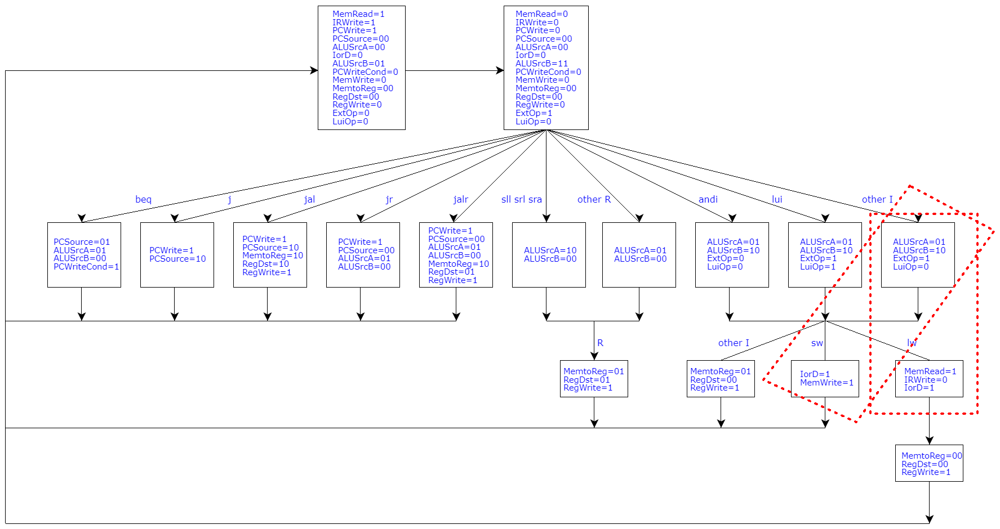
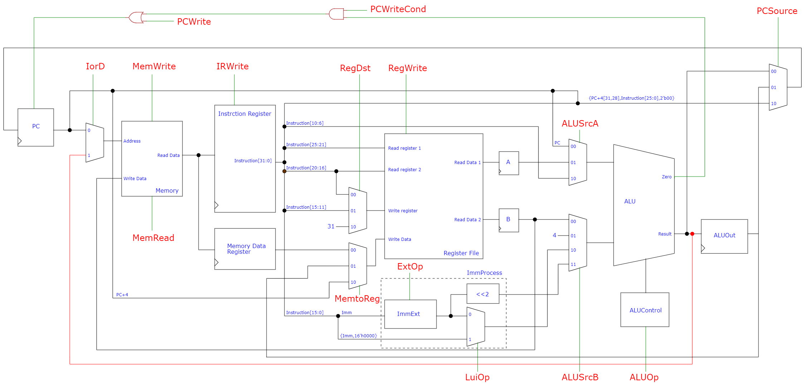

# 4状态多周期处理器-2

在5状态处理器基础上，合并有效地址计算和内存访问的实现。

有限状态机模型修改如下：



数据通路修改如下：


## 文件说明

MultiCycleCPU.v——顶层模块，结构与上述数据通路直接对应。

test_cpu.v——仿真测试平台（testbench）文件

multi_cycle.xdc——静态时序分析（STA）用约束文件

InstructionMemory-2.v——指令存储器，储存了汇编程序-3的代码机器码（见附录）

InstructionMemory-3.v——指令存储器，储存了汇编程序-3的代码机器码（见附录）

## 资源占用时序性能

构建项目（板卡型号xc7a35tcsg324-1）使用vivado工具进行综合，关闭`-flatten_hierarchy`优化选项。

资源占用报告（Utilization）表明共使用4769个查找表，9434个寄存器。相比原始实现少了3个查找表，多了1个寄存器。

经静态时序分析（STA）计算得该处理器实现最高时钟频率为178.5MHz，变为原来的104.8%。

对于汇编程序-2，该实现最快，总执行时间约1529.62ns。

## 附录——汇编程序

汇编程序-2

```asm
addi $a0, $zero, 5 #初始化$a0=5
xor $v0, $zero, $zero #初始化$v0=0
jal sum #跳转到sum并将死循环程序首指令的PC存入$ra
Loop:
beq $zero, $zero, Loop #跳转到Loop，死循环
sum:
addi $sp, $sp, -8 #过程调用准备压栈
sw $ra, 4($sp) #将$ra压栈
sw $a0, 0($sp) #将$a0压栈
slti $t0, $a0, 1 #若$a0<1则$t0置1
beq $t0, $zero, L1 #$t0=0时即$a0>=1时跳转到L1
addi $sp, $sp, 8 #$a0=0时恢复栈指针（即忽略掉$a0=0情况下的压栈内容）
jr $ra #跳转到$ra，只会在$a0=0时执行一次，跳转到出栈程序首指令
L1:
add $v0, $a0, $v0 #$v0+=$a0
addi $a0, $a0, -1 #$a0--
jal sum  #跳转到sum并将出栈程序首指令的PC存入$ra，形成递归
lw $a0, 0($sp) #将$a0出栈，效果相当于$a0++
lw $ra, 4($sp) #将$ra出栈，在压栈内容全部出栈前$ra均为出栈程序首指令PC，形成循环
addi $sp, $sp, 8 #恢复栈指针
add $v0, $a0, $v0 #$v0+=$a0
jr $ra #跳转到$ra，当全部出栈后$ra为死循环程序首指令PC，跳出此循环结束计算
```

汇编程序-3

```asm
addi $a0, $zero, 10 # x
addi $v0, $zero, 0
loop:
beq $a0, $zero, end
add $t0, $a0, $a0 # 2x
addi $t0, $t0, -8 # 2x-8
slt $t1, $t0, $zero 
sll $t1, $t1, 31
sra $t1, $t1, 31 # 2x-5<0?FFFFFFFF:00000000
and $t2, $t0, $t1 # min(2x-8,0)
addi $t2, $t2, 4 # min(2x-8,0)+4
add $v0, $v0, $t2
addi $a0, $a0, -1
j loop
end:
j end
```

## 版权声明

版权归本仓库作者及清华大学电子工程系（THU-EE）所有。