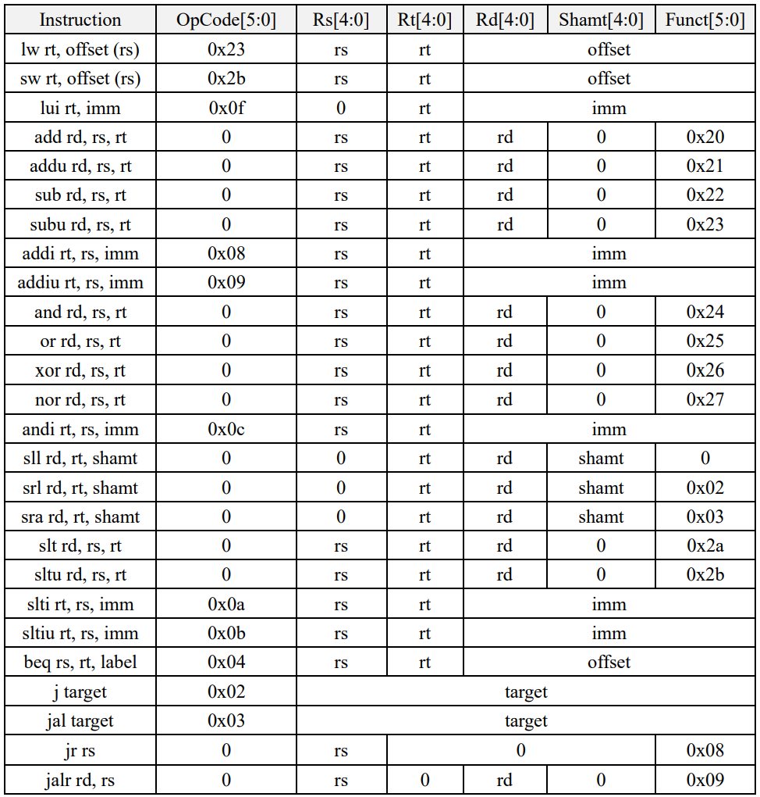

# 基于MIPS指令集子集的多周期微处理器

大二下《处理器基础》大作业部分内容。使用多周期处理器思路进行设计，支持包括以下26条MIPS指令的MIPS指令集子集：

## 说明

./5_state_CPU——在其有限状态机（FSM）模型中执行一条指令最多需要经过5个状态的多周期CPU。

./4_state_CPU_1——在5状态CPU基础上，合并寄存器更新操作和读内存或是ALU操作的实现。变为4状态CPU。

./4_state_CPU_2——在5状态CPU基础上，合并有效地址计算和内存访问的实现。变为4状态CPU。

## 版权声明

版权归本仓库作者及清华大学电子工程系（THU-EE）所有。